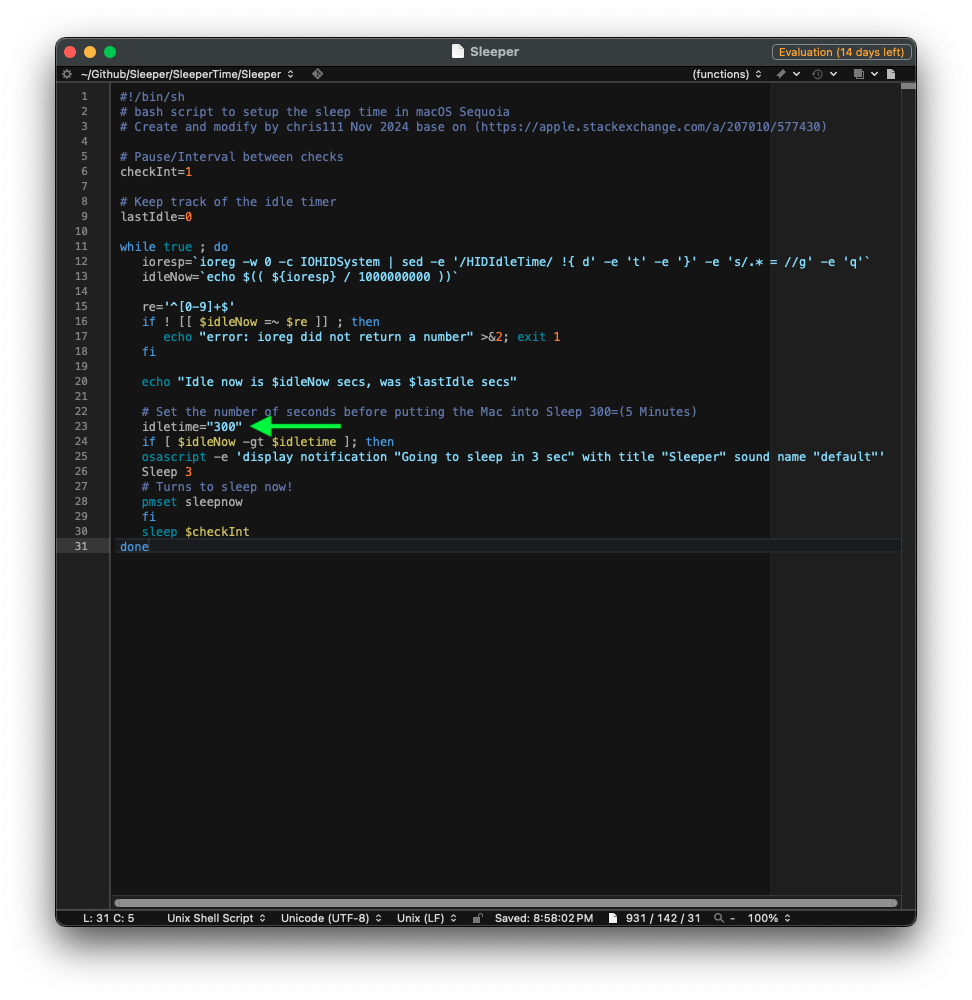
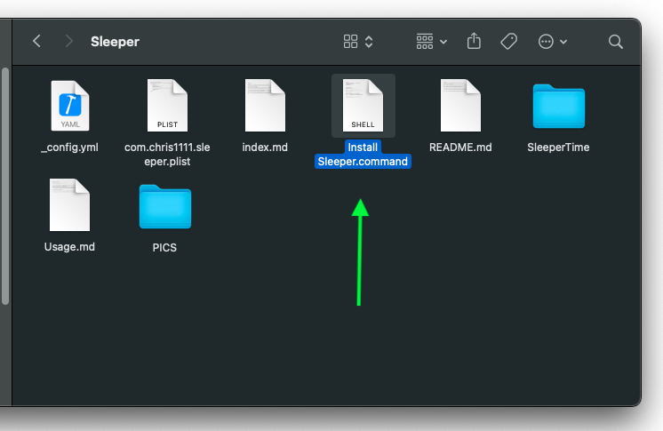
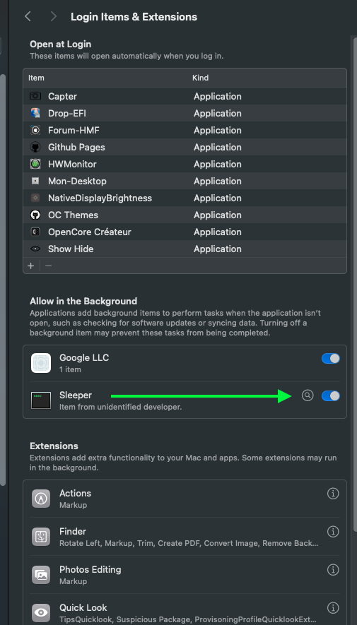

### 1- Clone repository
```bash
git clone https://github.com/chris1111/Sleeper.git
```
2- Edit the script `Sleeper` in folder SleeperTime
#### Set the number of seconds before putting the Mac into Sleep 300=(5 Minutes)
-  [`idletime="300"`](https://github.com/chris1111/Sleeper/blob/main/SleeperTime/Sleeper#L25)
  


3- Set up Lock Screen
- Setting up Screen Saver lower than your sleep time in the Sleeper script
- Setting up Turn Display Off when inactive higher than your sleep time in the Sleeper script


4- Run `Install Sleeper.command`



5- Reboot macOS




Take into account: At any time you can change the sleep time value in /Library/Application Support/SleeperTime/Sleeper
- After doing this ➥ Reboot macOS


