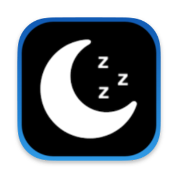

# Sleeper

Bash Script with a LaunchAgents to make the Mac in Sleep After Inactivity 
- This script solves the problem of those who cannot put the computer to sleep in macOS Sequoia

Inactivity and Idle Time on OS X
OS X has a timer called `HIDIdleTime` that tracks the last time you interacted with the computer.

OS X has a timer that tracks the last time you moved the mouse, typed a key, or interacted with the computer. This timer is used as the basis of idle time for when your Mac sleeps.

##### In technical terms, the timer goes by the name `HIDIdleTime` and is part of `IOKit’s IOHIDSystem`. [See here](https://www.dssw.co.uk/blog/2015-01-21-inactivity-and-idle-time/)

See ➤ [Sleeper script](https://github.com/chris1111/Sleeper/blob/main/SleeperTime/Sleeper)

How to ➤ [Use it](https://github.com/chris1111/Sleeper/blob/main/Usage.md)
